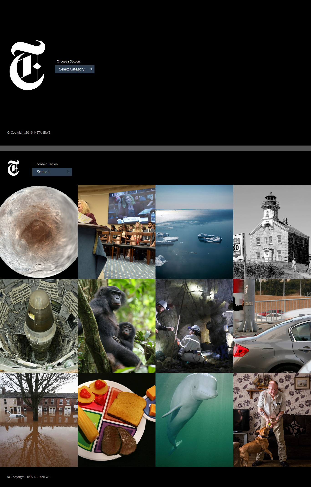

# NYTimes

###Software:
	

- Sublime Text (editing)
	

- Chrome (testing)
	

- GIT Bash (repo upload)

###Technologies Used
	

- html5, css3
, jquery
- keeping my codes clean, structured, and easy to read
	

- Used Font Squirrel to Download Font packages
	

- Used GIT Bash to push my local repo to Git Hub
	

- Validated index.html, style.css and reset.css

- Checked my main.js in eslint

- Used NYTimes API to grab information and articles using ajax
- Executed Jsplugins/code
	
- Heapbox
- Resizing Nav bar on click
- a whole div to be clickable
- Practiced using gulp tasks

###Stretched/Extra Goals
	

- Got heapbox to work
- when hover article slides up
- added a sliding title on top of the abstract
- added a grayscale on background picture on hover

###Future Goals
	

- to be able to use gulp to its full extent
